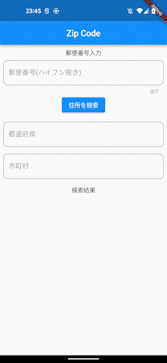

# zip_code_converter

本リポジトリは以下API（郵便番号検索API）の利用規約に基づいて作成させて頂いております。
http://zipcloud.ibsnet.co.jp/doc/api

This repository has been created based on the terms of use of the following API (Zip Code Search API).
http://zipcloud.ibsnet.co.jp/doc/api

# 作成経緯

郵便番号を検索するサンプルとして本リポジトリを作成。
freezedやHTTP通信の参考になれば幸いです。

Created this repository as a sample to search zip codes in Japan.
I hope it will be helpful for freezed and HTTP communication.

# Sample
